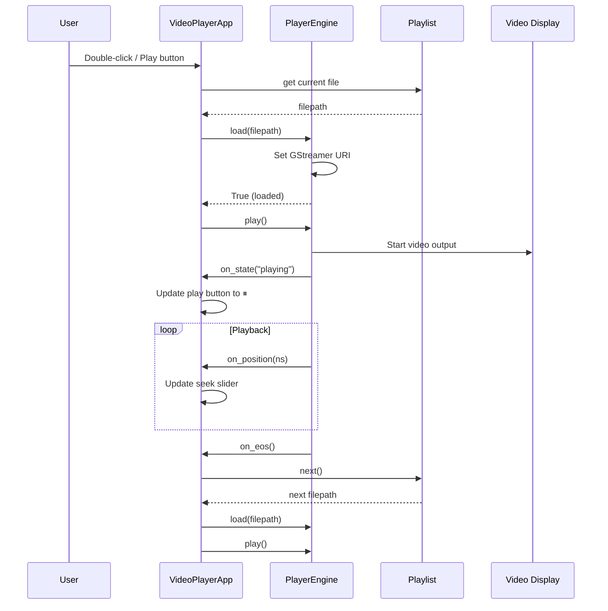
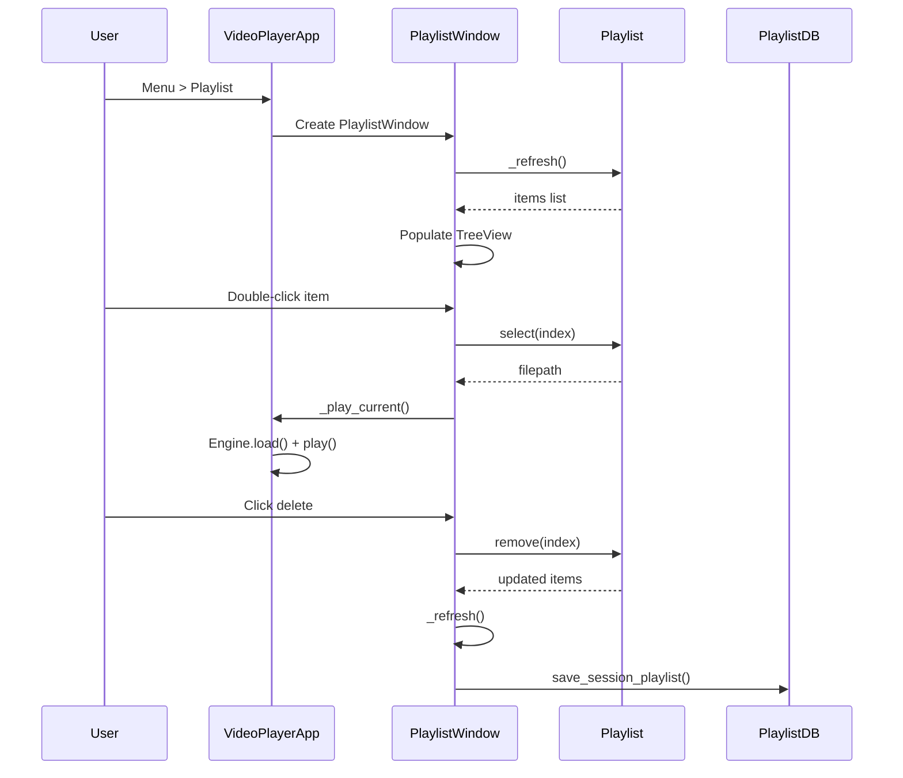
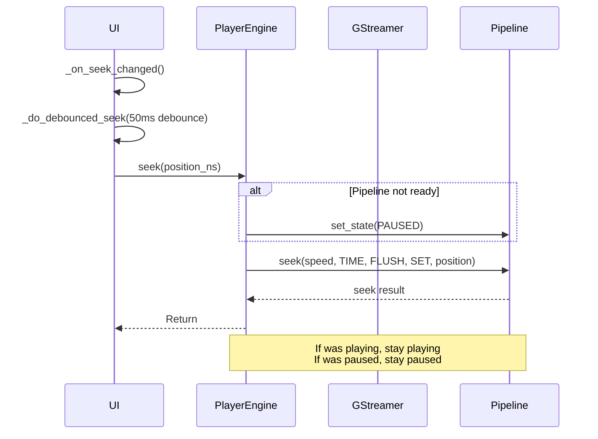
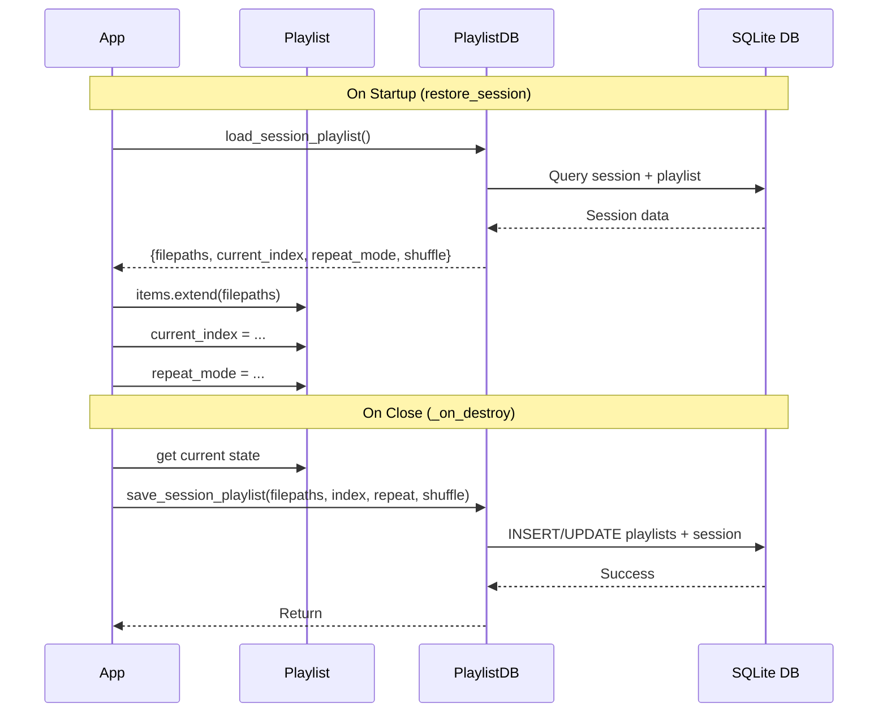
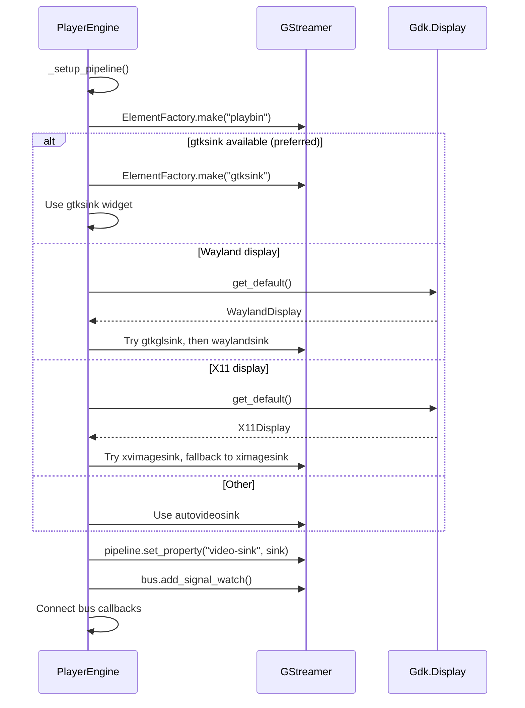

# madOS Video Player

A minimalist GTK3 video player using GStreamer for playback, featuring a floating controls interface, playlist management, and session persistence via SQLite.

## Features

- **Floating Controls**: Ultra-minimalist interface with controls that appear on hover
- **Playlist Management**: Add files, directories, shuffle, and repeat modes
- **Session Persistence**: Automatically saves and restores last playlist
- **Keyboard Shortcuts**: Space (play/pause), F/F11 (fullscreen), arrows (seek/volume)
- **Drag & Drop**: Drop video files directly onto the window
- **Multi-format Support**: MP4, MKV, AVI, MOV, WEBM, and many more

## Requirements

- Python 3
- GTK3
- GStreamer 1.0 + GStreamer Python bindings
- SQLite3 (built-in)

## Installation

```bash
# Run with Python module
python -m mados_video_player

# Or use the executable
./mados-video-player

# Or run directly
python __main__.py
```

## Architecture

### Frontend (GTK3 UI)

```
┌─────────────────────────────────────────────────────────────┐
│                      VideoPlayerApp                         │
│  ┌─────────────┐  ┌─────────────┐  ┌──────────────────┐   │
│  │  Overlay    │  │ Video       │  │ Floating         │   │
│  │  Container  │  │ Display     │  │ Controls         │   │
│  └─────────────┘  └─────────────┘  └──────────────────┘   │
└─────────────────────────────────────────────────────────────┘
         │                    │                    │
         ▼                    ▼                    ▼
┌─────────────────────────────────────────────────────────────┐
│                    PlaylistWindow                           │
│  ┌─────────────────────────────────────────────────────┐   │
│  │  TreeView with playlist items                       │   │
│  └─────────────────────────────────────────────────────┘   │
└─────────────────────────────────────────────────────────────┘
```

### Backend (Core Modules)

```
┌─────────────────────────────────────────────────────────────┐
│  player.py - GStreamer Engine                               │
│  ┌─────────────────────────────────────────────────────┐   │
│  │  PlayerEngine: play, pause, stop, seek, volume     │   │
│  │  Video sink detection (Wayland/X11/GTK)             │   │
│  │  Callbacks: on_eos, on_error, on_state, on_position│   │
│  └─────────────────────────────────────────────────────┘   │
└─────────────────────────────────────────────────────────────┘
         │
         ▼
┌─────────────────────────────────────────────────────────────┐
│  playlist.py - Playlist Management                          │
│  ┌─────────────────────────────────────────────────────┐   │
│  │  Playlist: add_file, add_directory, next, previous │   │
│  │  Repeat modes: NONE, ALL, ONE                       │   │
│  │  Shuffle support                                    │   │
│  └─────────────────────────────────────────────────────┘   │
└─────────────────────────────────────────────────────────────┘
         │
         ▼
┌─────────────────────────────────────────────────────────────┐
│  database.py - SQLite Persistence                           │
│  ┌─────────────────────────────────────────────────────┐   │
│  │  PlaylistDB: save/load playlists, session state    │   │
│  │  Tables: playlists, playlist_items, session         │   │
│  └─────────────────────────────────────────────────────┘   │
└─────────────────────────────────────────────────────────────┘
```

## Sequence Diagrams

### Frontend Flow: Play Video



### Frontend Flow: Playlist Management



### Backend Flow: Seek Operation



### Backend Flow: Session Persistence



### Backend Flow: Video Sink Detection



## Keyboard Shortcuts

| Key | Action |
|-----|--------|
| Space | Play/Pause |
| F / F11 | Toggle Fullscreen |
| Escape | Exit Fullscreen |
| Left/Right | Seek -10s / +10s (Ctrl for 60s) |
| Up/Down | Volume ±5% |
| M | Toggle Mute |
| N | Next track |
| P | Previous track |
| Ctrl+O | Open file |
| Ctrl+Q | Quit |

## File Structure

```
mados-video-player/
├── __init__.py         # Package metadata
├── __main__.py         # Entry point
├── app.py              # Main window (GTK)
├── player.py           # GStreamer engine
├── playlist.py         # Playlist logic
├── database.py         # SQLite persistence
├── theme.py            # Nord CSS theme
├── translations.py     # i18n strings
├── .gitignore
├── AGENTS.md          # Developer guidelines
└── README.md
```

## License

MIT License